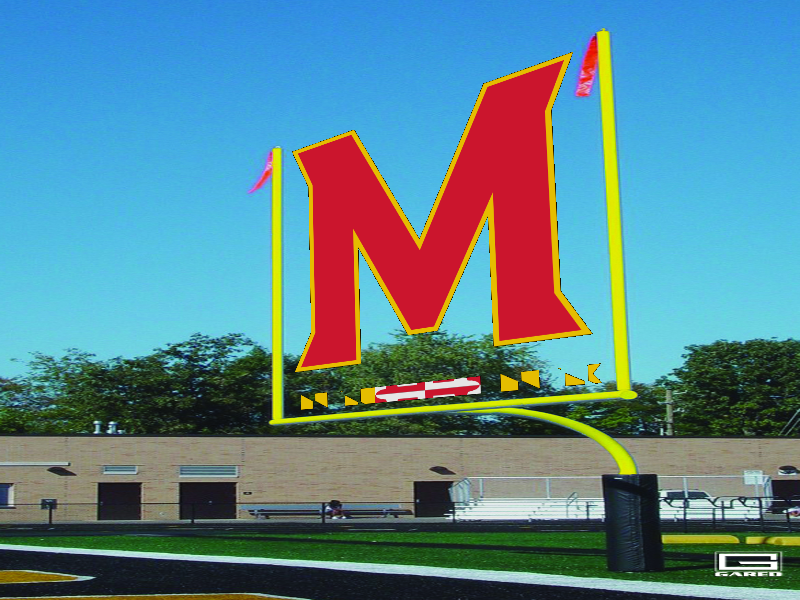

## Perception

## Homography

### Name
- Shantanu Parab

### Student ID
- sparab@umd.edu

## Installation Instructions
- To install numpy, run `pip install numpy` in your terminal.
- To install opencv, run `pip install opencv-python` in your terminal.

## Source Code Files
- [`homography.py`](homography.py) - This program takes in two images and a destination image and a logo. Then fits the logo on the destination image wherever instructed.
  + The program will run a and output the destination image.
  + Using the mouse left click on 4 points to fit the logo into.
  + Once 4 points are selected the program will output a image with logo on the destination points

## How to Run the Program:
To run the program, open the command prompt/terminal and navigate to the directory where the source code files are located. Then, type the following command: python [filename].py.

## Github Link
[Repository](https://github.com/shantanuparabumd/Homography.git)

## Destination Image

## Logo

## Output
